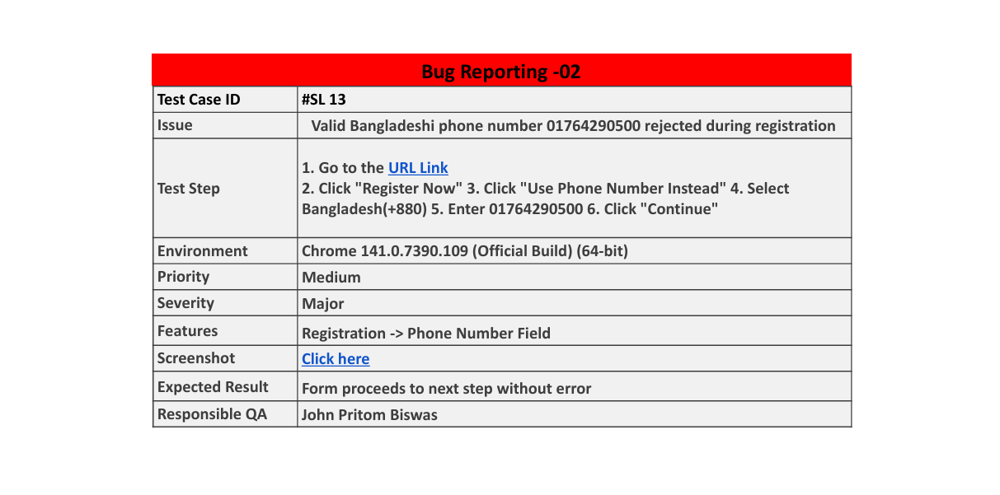

# 🐞 Bug Reports

This folder contains structured bug reports surfaced during manual testing of the OWASP-based web application. Each report includes severity level, reproduction steps, annotated screenshots, and QA comments — authored by John Pritom Biswas with actionable insights for developers.

---
📸 Sample Bug Reports

🔹 Bug Report 1  

---

🔹 Bug Report 2  

---

🔹 Bug Report 3  

---

## 🔗 Related Artifacts

- [`Test Plan`](../Test%20Plan/README.md)  
  Strategic QA plan detailing objectives, scope, testing types, environments, and timelines.

- [`Mind Map`](../Mind%20Map/README.md)  
  Conceptual breakdown of the OWASP registration flow, outlining validation logic and edge-case triggers.

- [`Test Case Report`](../Test%20Case%20Report/README.md)  
  Executed test cases with expected vs actual results, pass/fail status, and scope justifications.

- [`Test Matrix`](../Test%20Matrix/README.md)  
  Master Excel file mapping test cases to features/modules for coverage tracking and traceability.

- [`Screenshots`](../Screenshots/README.md)  
  Annotated visuals supporting bug reports and test case execution.

- [`Test Report`](../Test%20Case%20Report/README.md)  
  Final report summarizing test execution results, defect trends, coverage metrics, and QA recommendations.

- [`Documentation`](../Documentation/README.md)  
  Full QA documentation suite including test plan, test case report, mind map, bug reports, screenshots, and consolidated test matrix.

