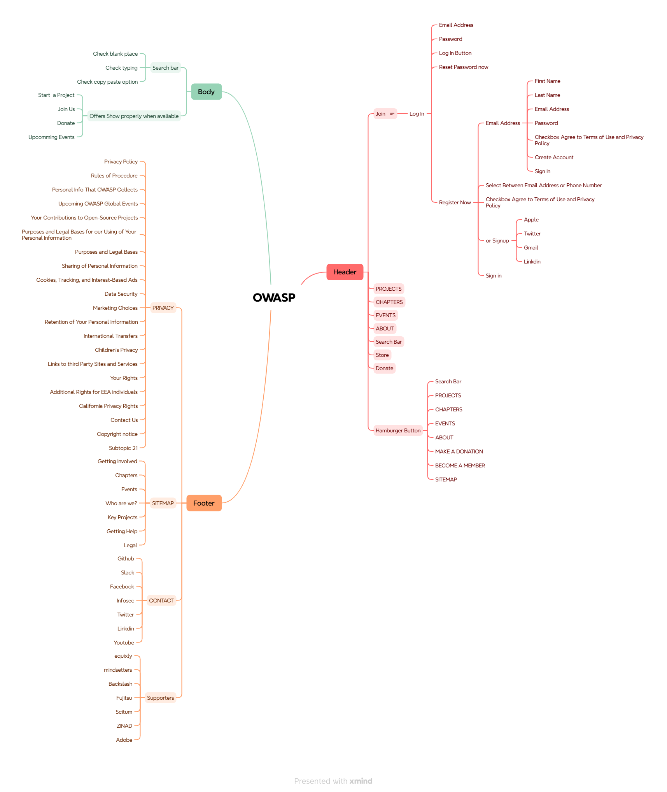

## 🧠 Mind Map

This folder includes a visual mind map of the OWASP registration flow. It outlines field dependencies, validation logic, and user interaction paths. Designed to support test planning and edge-case identification.

📸 Mind Map  

---
## 🎯 QA Purpose

This mind map helps visualize the registration module’s logic and flow, enabling:

✅ Early identification of test scenarios

✅ Efficient edge-case coverage

✅ Clear communication with developers and stakeholders
