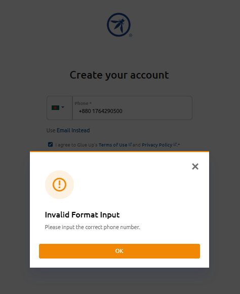
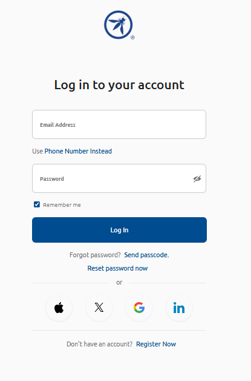

## 🖼️ Screenshots
This folder contains annotated screenshots captured during manual testing of the OWASP-based web application. Each image supports a documented bug report, highlighting UI issues, validation failures, and edge-case behavior.

---

## 🔹 Bug Screenshots 1 

## 🔹 Bug Screenshots 2

## 🔹 Bug Screenshots 3

---

## 📌 Purpose
Screenshots serve as visual evidence for:

## 🐞 Bug reproduction and severity assessment

## 🧪 UI validation and layout inconsistencies

## ⚠️ Edge-case triggers and unexpected behavior

## 📎 Developer handoff and stakeholder communication

Each screenshot is referenced in the corresponding bug report for traceability and audit clarity.

