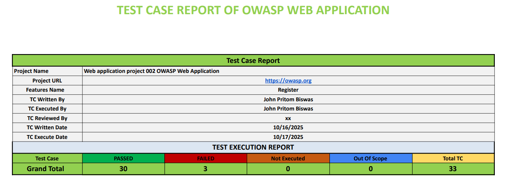
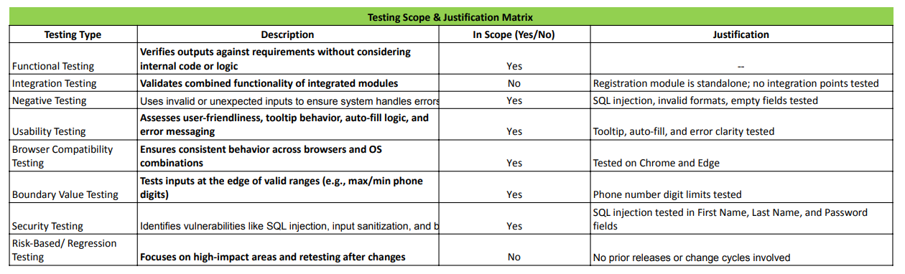

# 📋 Test Case Report

This folder contains detailed test cases and scope justifications for manual QA of the OWASP-based web application. It demonstrates structured planning, execution, and rationale behind the selected testing areas.

---

## 📌 Contents

| File | Description |
|------|-------------|
| `Test Case Report.xlsx` | Spreadsheet of executed test cases with expected vs actual results, status, and QA comments. |
| `Test Scope Justification.xlsx` | Explains why specific modules, flows, and edge cases were prioritized during testing. Includes risk analysis and OWASP relevance. |

---
🖼️ Test Case Report 

🖼️ Test Scope Justifications

---

## 🧪 QA Coverage

The test case report includes:

- ✅ Unique Test IDs and titles  
- 🧠 Preconditions and step-by-step execution  
- 🎯 Expected vs actual results  
- ❌ Pass/fail status with severity tags  
- 📝 QA observations and notes  

---

## 🎯 Scope Justification Highlights

- Focused on high-risk modules based on OWASP guidelines  
- Prioritized user registration, login, and input validation flows  
- Included edge-case scenarios and negative testing  
- Justified exclusions based on time constraints, risk level, and feature stability

---

## 🔗 Related Artifacts

## 🔗 Related Artifacts

- [`Test Plan`](../Test%20Plan/README.md)  
  Strategic QA plan detailing objectives, scope, testing types, environments, and timelines.

- [`Mind Map`](../Mind%20Map/README.md)  
  Conceptual breakdown of the OWASP registration flow, outlining validation logic and edge-case triggers.

- [`Test Case Report`](../Test%20Case%20Report/README.md)  
  Executed test cases with expected vs actual results, pass/fail status, and scope justifications.

- [`Test Matrix`](../Test%20Matrix/README.md)  
  Master Excel file mapping test cases to features/modules for coverage tracking and traceability.

- [`Bug Reports`](../Bug%20Reports/README.md)  
  Structured bug documentation with severity, reproduction steps, screenshots, and QA comments.

- [`Screenshots`](../Screenshots/README.md)  
  Annotated visuals supporting bug reports and test case execution.

- [`Documentation`](../Documentation/README.md)  
  Full QA documentation suite including test plan, test case report, mind map, bug reports, screenshots, and consolidated test matrix.

