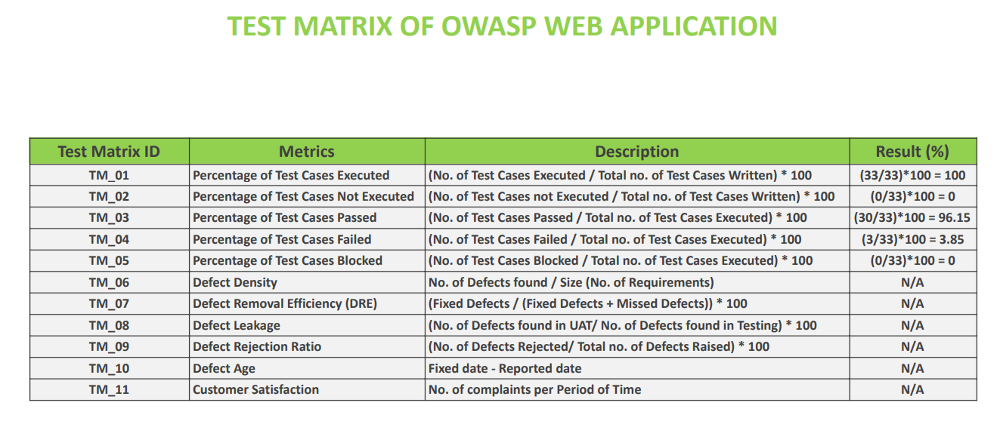

# 🧪Test Matrix

This folder includes execution metrics and coverage analysis for the OWASP registration test suite. It tracks total cases, pass/fail rates, defect density, and test efficiency. Useful for stakeholders, audit teams, and QA retrospectives.

### Test Matrix  

---

## 🔗 Related Artifacts

- [`Test Matrix`](../Test%20Matrix/README.md)  
  Maps test cases to features/modules for coverage tracking and traceability.

- [`Bug Reports`](../Bug%20Reports/README.md)  
  Structured bug documentation with severity, reproduction steps, screenshots, and QA comments.

- [`Screenshots`](../Screenshots/README.md)  
  Annotated visuals supporting bug reports and test case execution.

- [`Mind Map`](../Mind%20Map/README.md)  
  Conceptual breakdown of the OWASP registration flow, outlining validation logic and edge-case triggers.

- [`Documentation`](../Documentation/README.md)  
  Full QA documentation suite including test plan, test case report, mind map, bug reports, screenshots, and consolidated test matrix.

- [`Test Case Report`](../Test%20Case%20Report/README.md)  
  Executed test cases with expected vs actual results, pass/fail status, and scope justifications.
